# Polls

## Poll Creation

* Click on “Polls” tab on your ton left of the page after logging in into OPRA to get the below page. You can create a new poll by clicking on “Create New” button and complete the configuration steps.
* Under the section of “Regular polls created by you”, you will see all the polls that you have created. 
* Under the section of “Participated in”, you can see the polls that you are invited to participate in.
* You can search all the polls created by you in the top search box and filter it out based on key word in the name of the Poll.

### Step 1: Basic Info

1. Title: Give a unique name to all the polls created by you. 
2. Question Description: Some meaningful description.
3. Question type: If you are creating a poll, select “Poll”. If you are creating an allocation, select “Allocation”. “Poll” is pre selected.
4. “Allow Ties” section, allows the user to give same preference to more than one option/candidate.

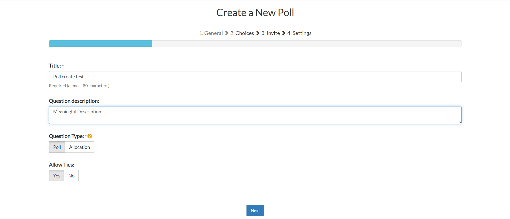

### Step 2: Alternatives
1. Option name: Give a unique option name.
2. Add photo to be displayed by the side of option if required.
3. Click on “+” to add the option. 
4. Repeat the process until you add all your options.
5. Click in “x” symbol to remove an option 

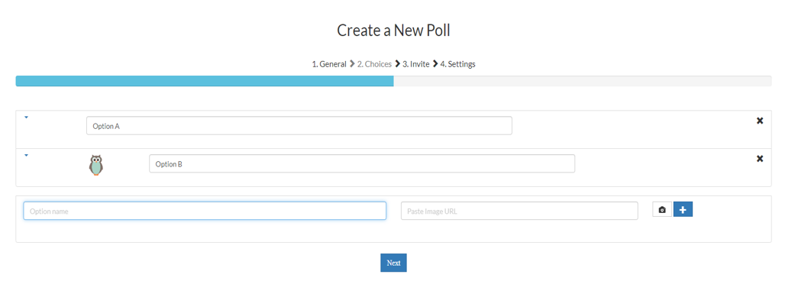

### Step 3: Invite Users
1. In “Add users registered with OPRA” under  the section “Add Multiple Pre-Registered Users/Groups:” , search for the users with their username whom you wish to take part in this new poll.
2. You can also add/remove a group of users to the instance under “Add/Remove groups of users registered with OPRA:” section. Further details of how to create a group is explained in the upcoming slides.
3. “Users added to the instance:” section shows the users that were added to the current instance. 

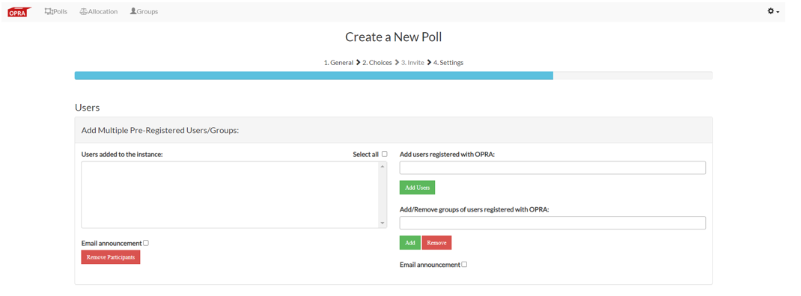

4. You can notify the users while adding and removing by checking “Email announcement” checkbox. 
5. The content of the mail is pre-populated yet can be modified.

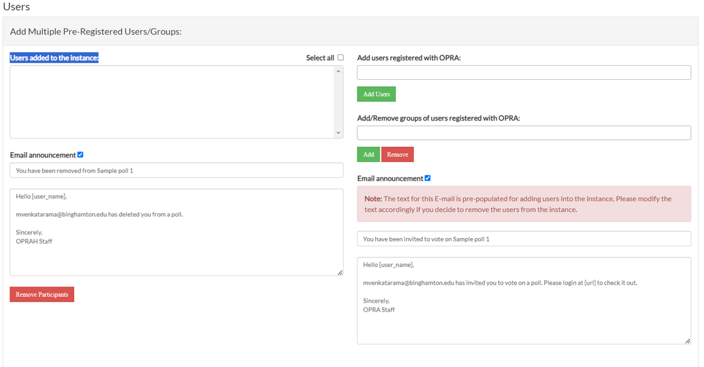

6. Under the section “Add Users with CSV:” enter the comma separated values in the “Enter the comma seperated email-IDs to add/invite users:” field as advised in the ‘Note’ section of the same page. 
7. The csv email IDs are split into 
      * Users registered with OPRA and 
      * Users not registered with OPRA 
8. Users not registered with OPRA, but invited to the poll will be sent out an email to register with OPRA. Once they register, the user will automatically be invited to the poll.

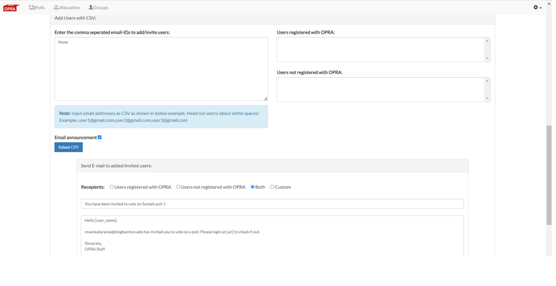

### Step 4: Algorithms, Visibility, Accessibility, UI for preference
1. Select an algorithm by which the result must be calculated for the poll. 
2. Check all the box by which the results must be calculated and showed in the result page. 
 
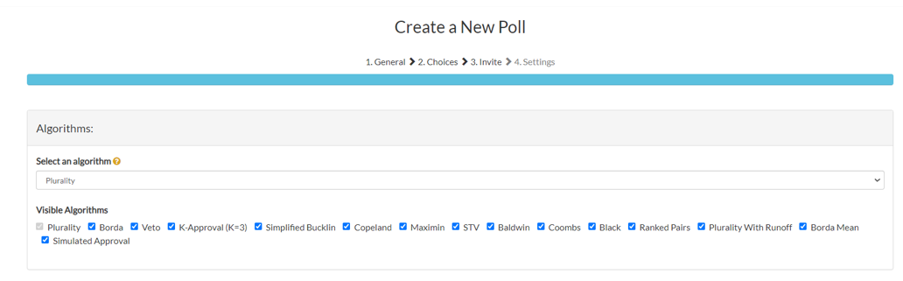
 
3. Select the Visibility settings for displaying preference, user-info and for the creator of the poll. Below are the available options.
4. All of the below combinations will work.
 
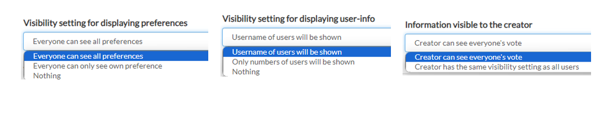
 
5. The creator can decide on who can participate in the poll and can also decide whether self sign up is allowed for the poll. 
6. Below are the available options.
 
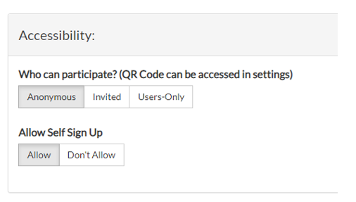
 
7. The user can give their preferences from more than one UI. Below are the available options.

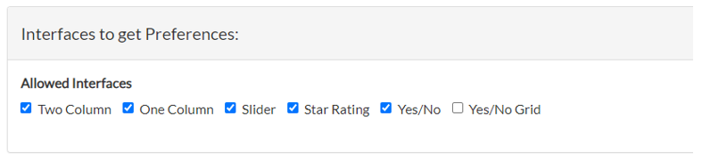

## Poll Settings

* The Poll settings will have all the things that were configured during poll creation, but with some restriction to modify 
* Only selected configurations of the poll. On the right, the pic shows the list of Poll setting tabs.

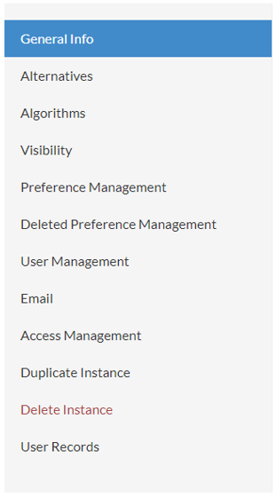

### Poll Settings - Preference Management:
1. The creator can see and delete(based on settings) the preferences that has been submitted to this Poll by the users. 

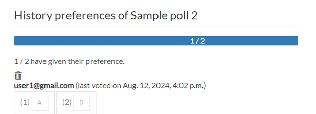

### Poll Settings - Email:
1. You can check the box to notify users via email when the poll is started and stopped. The email text is pre-populated for both the cases and its editable.

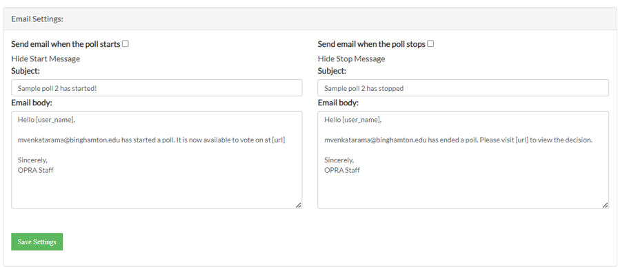

### Poll Settings – Duplicate/Delete instance 
1. There is an option to duplicate the poll at its current state.
2. There is an option to delete the poll as well.

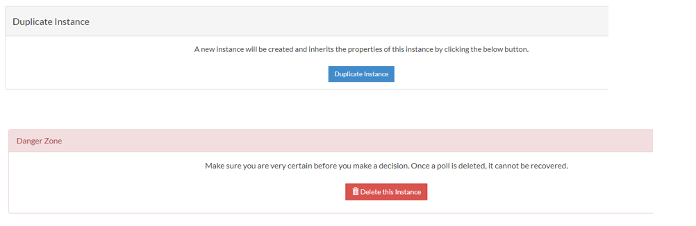

## UI to get preferences 
### Two Columns:
1. Allows users to their submit preferences by moving the all/partial options from right column to left column.

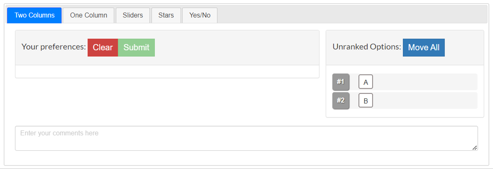

### One Column:
1. Allows user to give preferences to all the options. 

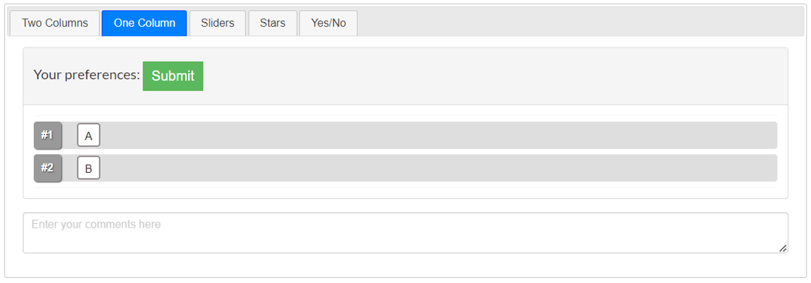

### Sliders:
1. Allows users to submit preferences with the help of sliders. 

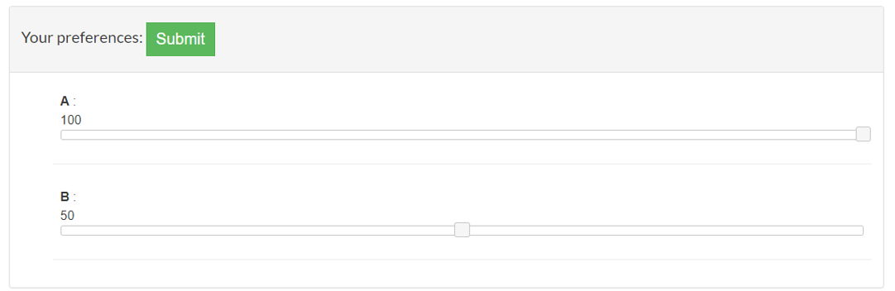

### Stars:
1. Allows user to submit preferences in stars.

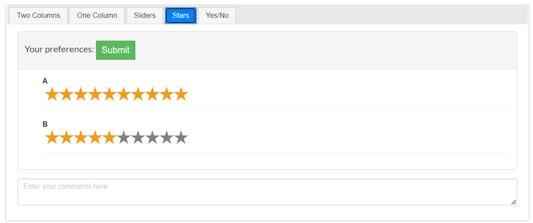

### Yes/No
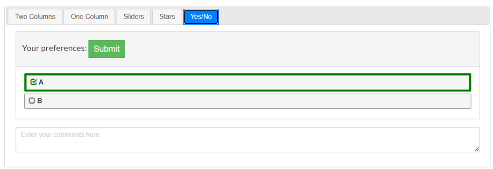

## Polls Results 
Poll results are calculated based on the selected algorithms.
 
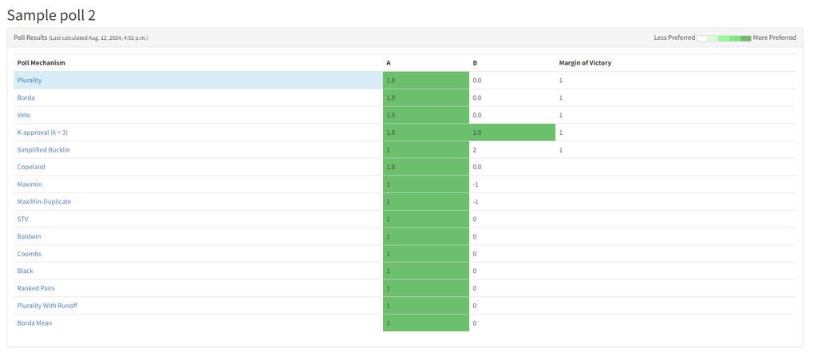